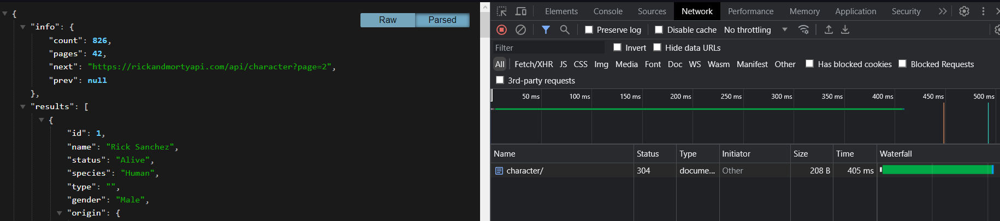
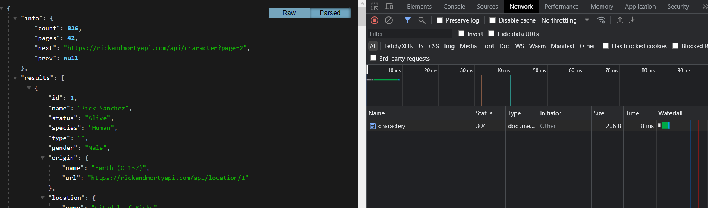
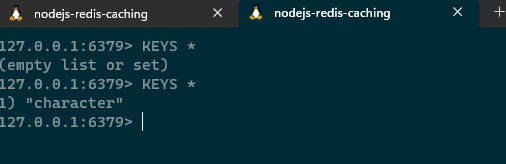

# Proyecto de Node.js con Redis

Este proyecto es una aplicación Node.js que utiliza el framework Express para crear un servidor web y Redis para almacenar en caché datos obtenidos de la API pública de Rick and Morty. La aplicación permite acceder a información sobre personajes de la serie.

## Funcionalidades

- Consulta la lista de personajes desde la API de Rick and Morty y almacena los datos en caché utilizando Redis.
- Consulta detalles de un personaje específico por su ID y almacena los datos en caché.
- Utiliza el módulo `response-time` para medir el tiempo de respuesta de las solicitudes.

## Requisitos

- Node.js
- Redis (debe estar en funcionamiento en `localhost` en el puerto `6379`)

## Instalación

1. Clona este repositorio: `git clone https://github.com/TuUsuario/tu-proyecto.git`
2. Ingresa al directorio del proyecto: `cd tu-proyecto`
3. Instala las dependencias: `npm install`

## Configuración

Asegúrate de que Redis esté en ejecución en `localhost` en el puerto `6379`. Si necesitas cambiar la configuración de conexión a Redis, puedes hacerlo en el archivo `src/database/index.js`.

## Uso

1. Inicia la aplicación: `npm start`
2. Accede a la aplicación desde tu navegador o herramienta de pruebas API:
   - Lista de personajes: `http://localhost:3000/character`
   - Detalles de un personaje: `http://localhost:3000/character/ID_DEL_PERSONAJE`

### Cuando se ejecuta por primera vez

### Cuando se ejecuta por segunda vez

### Llave almacenada en redis

## Autor

[Fabio Fiestas](https://www.linkedin.com/in/fabio-fiestas/)

